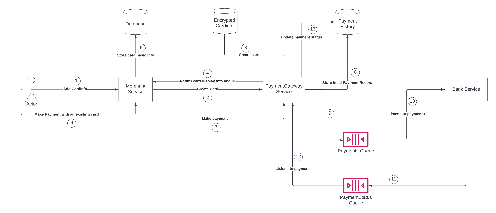
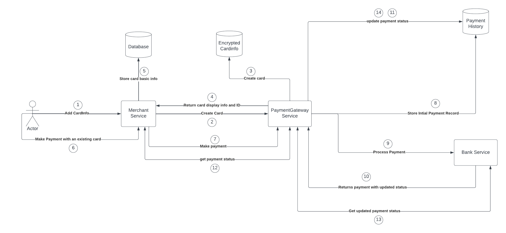
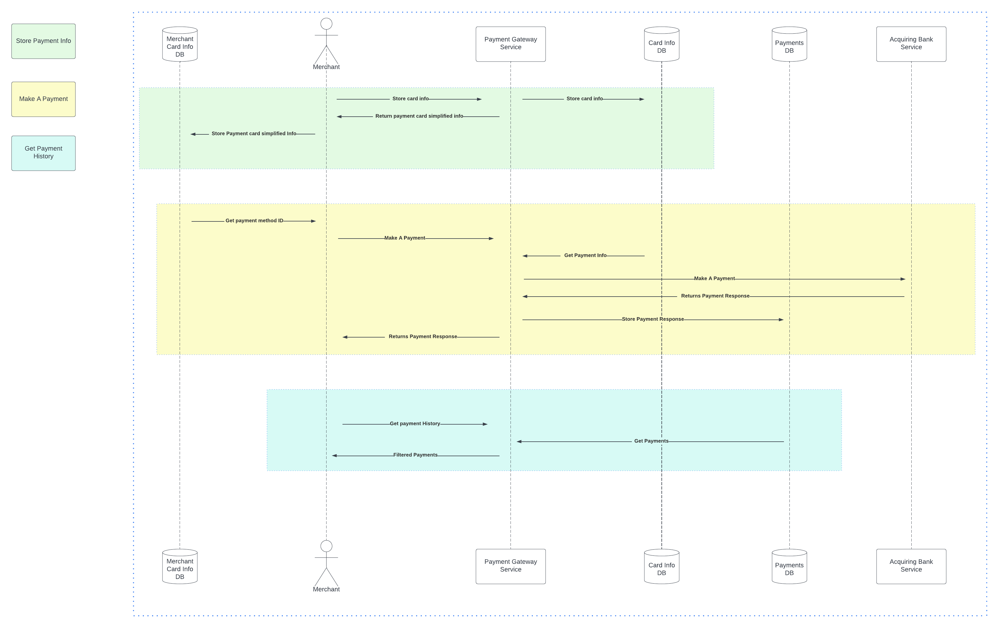

# Summary

| Question                                | Answer                                                                                                                                                                                                                                                                                                                                                                                            |
|-----------------------------------------|---------------------------------------------------------------------------------------------------------------------------------------------------------------------------------------------------------------------------------------------------------------------------------------------------------------------------------------------------------------------------------------------------|
| Time Spent for design and implementation | 2 hours, 47 minutes                                                                                                                                                                                                                                                                                                                                                                               |
| Technologies                            | Java17, Spring Boot, PostgreSQL, Hibernate                                                                                                                                                                                                                                                                                                                                                        |
| Features                                | 1. Store Card.<br/> 2. Retrieve Cards information by merchant and userId<br/>3. Process payment.<br/>4. Retrieve payments using user and merchant<br/>5. Pull latest payment status updates                                                                                                                                                                                                       |
| Run                                     | Docker, Docker Compose, or manual DB creation with app running.                                                                                                                                                                                                                                                                                                                                   |
| Mock Bank                               | Bank is mocked through another API running locally.                                                                                                                                                                                                                                                                                                                                               |
| Main Missing Components                 | 1. Authorization and Authentication roles<br/>2. Data Encryption of `Card` information.<br/>3. Request Validatoin<br/>4. Unit and Integration tests.<br/>5. Async communication to allow bank updates coming from the banks.<br/>6. Delete/Update endpoint to update/delete cards.<br/>7. Error handling of different cases in the endpoints.<br/>8. Generate a unique API key for each merchant.<br/> |

----------------------------------------------------------------
# High Level Async Design
This is the design I would implement in real life to make sure that the updated payment status is accessible from the merchant easily.


[View on LucidChart](https://lucid.app/lucidchart/94ad9f2d-40c3-4884-af47-e7d424349f3f/edit?viewport_loc=-287%2C-295%2C3675%2C1857%2C0_0&invitationId=inv_8e6fe67f-73b1-4f02-8e67-902d77fd4dba)

For the sake of simplicity, There is no queue integration in the current implementation. However, there is a simple mocked response that is being sent through a mockBank API which is requested through a Callable



[View on LucidChart](https://lucid.app/lucidchart/2685adfd-376d-420c-b303-27be5d5100f1/edit?invitationId=inv_57e01ce4-229d-44f9-93ff-47e1832b6eea)

----------------------------------------------------------------
# Motivation
This is a payment gateway that helps to collect money for merchants, store cards information, and keep track of payments history.

----------------------------------------------------------------
# Requirements
1. Store card information.
2. Retrieve card information.
3. Process a payment through the gateway.
4. Retrieve payments.
----------------------------------------------------------------
# Setup
## Easy Setup
- Just run `docker-compose up`, and it will spin up the app service and the postgres service.
- The service will be running on `http://localhost:8080/`

## Alternative Setup
1. Create the database:
```bash
sudo docker run --name payments -p 5432:5432 -e POSTGRES_USER=test -e POSTGRES_PASSWORD=test -d postgres
```
Output:
```bash
CONTAINER ID   IMAGE      COMMAND                  CREATED         STATUS         PORTS                    NAMES
32e7a0f07ba8   postgres   "docker-entrypoint.s…"   6 minutes ago   Up 6 minutes   0.0.0.0:5432->5432/tcp   payments
```
2. Run the service through running `PaymentGatewayApplication`

----------------------------------------------------------------
# Payment Gateway API
## Card Operations
1. Get the stored cards for a specific user in a specific merchant:
```
GET http://localhost:8080/api/card/merchant/{merchantId}/user/{userId}
```
**Return:**
```json
[
    {
        "cardId":652,
        "userId":"123",
        "merchantId":"1234",
        "displayCardNumber":"**** **** **** 8765",
        "createdAt":1675531493858,
        "updatedAt":1675531493859
    }
]
```

2. Add a card for a specific user in a specific merchant:
```
POST http://localhost:8080/api/card/merchant/{merchantId}/user/{userId}
```
**Request Body:**
```json
{
	"cardNumber": "1234 5678 4321 8765",
	"displayName": "Addy",
	"expMonth": 1,
	"expYear": 25,
	"cvv": 123
}		
```
**Return:**
```json
{
    "cardId": 702,
    "userId": "123",
    "merchantId": "1234",
    "displayCardNumber": "**** **** **** 8765",
    "createdAt": 1675540931248,
    "updatedAt": 1675540931248
}
```
## Payment Operations
1. Get the payment history for a specific user in a specific merchant:
```
GET http://localhost:8080/api/payment/merchant/{merchantId}/user/{userId}
```
**Return:**
```json
[
    {
        "paymentId":652,
        "cardId":503,
        "merchantId":"1234",
        "userId":"123",
        "paymentStatus":"PROCESSING",
        "createdAt":1675534050928,
        "updatedAt":1675534055027
    },
    {
        "paymentId":752,
        "cardId":652,
        "merchantId":"1234",
        "userId":"123",
        "paymentStatus":"SUCCESSFUL",
        "createdAt":1675538891083,
        "updatedAt":1675538905975
    }
]
```

2. Make a payment for a specific user in a specific merchant using a specific payment card:
```
POST http://localhost:8080/api/payment/merchant/{merchantId}/user/{userId}
```
**Request Body:**
```json
{
  "cardId": 652,
  "amount": 550.89,
  "currency": "USD"
}
```
**Return:**
```json
{
    "paymentId": 802,
    "cardId": 652,
    "merchantId": "1234",
    "userId": "123",
    "paymentStatus": "PROCESSING",
    "createdAt": 1675541283655,
    "updatedAt": 1675541283655
}
```

3. Get the payment status
```
GET http://localhost:8080/api/payment/merchant/{merchantId}/user/{userId}/payment/{paymentId}
```
**Return:**
```json
{
    "paymentId":752,
    "cardId":652,
    "merchantId":"1234",
    "userId":"123",
    "paymentStatus":"SUCCESSFUL",
    "createdAt":1675538891083,
    "updatedAt":1675538905975
}
```
----------------------------------------------------------------
# Mock Bank API
The mock bank API has two endpoints. 
1. Process a payment
```
POST http://localhost:8080/mockBank/processPayment
```
2. Get updated payment status
```
POST http://localhost:8080/mockBank/paymentStatus/merchant/{merchantId}/user/{userId}/payment/{paymentId}
```
----------------------------------------------------------------
# Sequence Diagram


[View Sequence Diagram on LucidChart](https://lucid.app/lucidchart/b45fdfc0-2396-407b-888b-40b0e8568c06/edit?viewport_loc=-1638%2C87%2C4018%2C2030%2C0_0&invitationId=inv_ae4b9d5d-d01d-4d17-af0e-00f9a8f9c11a)

----------------------------------------------------------------
