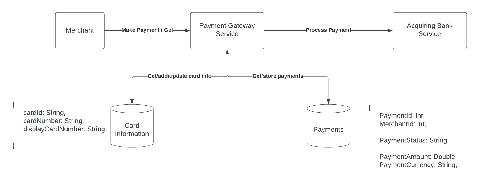

# Summary

| Question                                | Answer                                                                                                                                          |
|-----------------------------------------|-------------------------------------------------------------------------------------------------------------------------------------------------|
| Time Spent for design and implementation | 2 hours, 47 minutes                                                                                                                             |
| Technologies                            | Java17, Spring Boot, PostgreSQL, Hibernate                                                                                                      |
| Features                                | 1. Store Card.<br/> 2. Retrieve Cards information by merchant and user<br/>3. Process payment.<br/>4. Retrieve payments using user and merchant |
| Run                                     | Docker, Docker Compose, or manual DB creation and app running.                                                                                  |
| Mock Bank                               | Bank response is mocked through another API running locally that provides promises with the payment status                                      |
| Main Missing Components                 | 1. Authorization and Authentication roles<br/>2. Data Encryption of `Card` information.<br/>3.Request Validatoin.4                              |


# High Level Design

[View on LucidChart](https://lucid.app/lucidchart/94ad9f2d-40c3-4884-af47-e7d424349f3f/edit?viewport_loc=-287%2C-295%2C3675%2C1857%2C0_0&invitationId=inv_8e6fe67f-73b1-4f02-8e67-902d77fd4dba)

For the sake of simplicity, There is no queue integration in the current implementation. Howeverm, there is a simple mocked response that is being sent through a mockBank API.

----------------------------------------------------------------

# Motivation
This is a payment gateway that helps to collect money for merchants, store cards information, and keep track of payments history.

----------------------------------------------------------------
# Requirements
1. Store card information.
2. Retrieve card information.
3. Process a payment through the gateway.
4. Retrieve payments.
----------------------------------------------------------------
# Setup
## Easy Setup
- Just run `docker-compose up`, and it will spin up the app service and the postgres service.
- The service will be running on `http://localhost:8080/`

## Alternative Setup
1. Create the database:
```bash
sudo docker run --name payments -p 5432:5432 -e POSTGRES_USER=test -e POSTGRES_PASSWORD=test -d postgres
```
Output:
```bash
CONTAINER ID   IMAGE      COMMAND                  CREATED         STATUS         PORTS                    NAMES
32e7a0f07ba8   postgres   "docker-entrypoint.s…"   6 minutes ago   Up 6 minutes   0.0.0.0:5432->5432/tcp   payments
```
2. Run the service through running `PaymentGatewayApplication`

----------------------------------------------------------------
# API
## Card Operations
1. To get the stored cards for a specific user in a specific merchant:
```
GET http://localhost:8080/api/card/merchant/{merchantId}/user/{userId}
```
**Return:**
```json
[
   {
      "cardId":3,
      "userId":"1234",
      "merchantId":"123",
      "displayCardNumber":"**** **** **** 8765",
   }
]
```

2. To add a card for a specific user in a specific merchant:
```
POST http://localhost:8080/api/card/merchant/{merchantId}/user/{userId}
```
**With Body:**
```json
{
	"cardNumber": "1234 5678 4321 8765",
	"displayName": "Addy",
	"expMonth": 1,
	"expYear": 25,
	"cvv": 123
}		
```
**Return:**
```json
{
    "cardId": 3,
    "userId": "1234",
    "merchantId": "123",
    "displayCardNumber": "**** **** **** 8765"
}
```
## Payment Operations
1. To get the payment history for a specific user in a specific merchant:
```
GET http://localhost:8080/api/payment/merchant/{merchantId}/user/{userId}
```
**Return:**
```json
[
  {
    "paymentId":1,
    "cardId":121,
    "merchantId":"123",
    "userId":"1234",
    "createdAt":"2023-01-29T23:52:42.341+00:00",
    "paymentStatus":"PROCESSING"
  }
]
```

2. To add make a payment for a specific user in a specific merchant:
```
POST http://localhost:8080/api/payment/merchant/{merchantId}/user/{userId}
```
**With Body:**
```json
{
  "cardId": 121,
  "amount": 550.89,
  "currency": "USD"
}
```
**Return:**
```json
{
  "paymentId": 5,
  "cardId": 121,
  "merchantId": "123",
  "userId": "1234",
  "createdAt": "2023-01-29T23:52:45.060+00:00",
  "paymentStatus": "PROCESSING"
}
```
This endpoint is making a request to another endpoint to mock the bank, which returns a promise.

## Mock Bank
The mock bank API is supposed to return a promise or a completableFuture response since it could takek long to process. In the current implementation, it only returns mocked value for simplicity. In real life, I would have done this using a queue system similar to what is described in the high level design above.

----------------------------------------------------------------
# Proposed System Architecture

[View System Architecture on LucidChart](https://lucid.app/lucidchart/137bb68a-d4fa-40fe-b990-fe3c348ad6f7/edit?invitationId=inv_a02afc98-2acf-40aa-9979-ddc95813f8f6)


[View Sequence Diagram on LucidChart](https://lucid.app/lucidchart/b45fdfc0-2396-407b-888b-40b0e8568c06/edit?viewport_loc=-1638%2C87%2C4018%2C2030%2C0_0&invitationId=inv_ae4b9d5d-d01d-4d17-af0e-00f9a8f9c11a)

----------------------------------------------------------------

# Missing Features and Future Improvements
1. Make the request to the mock bank CompletableFuture async call.
2. Data Validation in the API.
3. Usage of Enums instead of Strings.
4. Writing Unit Tests.
5. Implement Authentication and Authorization
6. Implement API Key instead of the merchant ID
7. Introduce encryption logic for the card information
8. Add more integration tests.
9. Error handling is missing.
10. Handle errors through the API
11. Deploy the service to a cloud service like AWS.
12. Create a service to mock the bank.
13. Endpoints to update or delete Card information.
14. Use a message queue instead of a rest service to communicate with the mock bank, and listen to another queue to update the payment status through the payment gateway service.
15. Some names are not great, like using paymentRequest to represent paymentRequestBody
16. Avoid wildcard imports ".*".